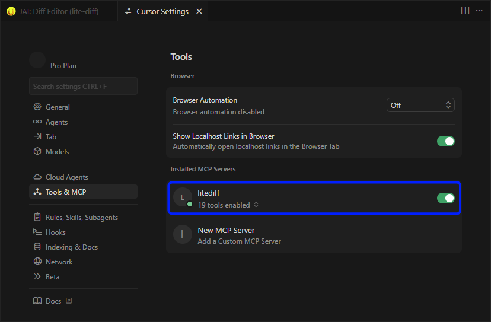

# Cursor IDE

Connect lite-diff to Cursor for AI-assisted code patching.

## Quick Start

### 1. Start MCP Server in Cursor

**Option A: MCP Menu**

1. Click `MCP` button in lite-diff panel
2. Select **Cursor IDE**

**Option B: Status Bar**

Click `MCP` in Status Bar (bottom of VS Code) to toggle server on/off.

> **Note:** Uses last selected client. To change client, use MCP Menu or Command Palette.

**Option C: Command Palette**

1. Open Command Palette (`Ctrl+Shift+P`)
2. Run: `Diff Editor: Start MCP Server`
3. Select: **Cursor IDE**

Status Bar will show: `● MCP`

### 2. Cursor Settings

1. Open Cursor Settings (`Ctrl+Shift+J`)
2. Go to **Tools & MCP**
3. Enable **litediff** toggle

You should see: `litediff — 19 tools enabled`



> **Note:** Cursor may reset the toggle after restart. If litediff tools stop working, check that the toggle is still enabled.

### Try It

Open Cursor Chat (`Ctrl+L`) and ask:
```
What litediff tools are available?
```

Cursor should list 19 tools including `litediff_preview`, `litediff_apply`, `litediff_validate`.

---

## Configuration

### Custom Port

Default port is `6010`. To use a different port:
```json
// VS Code settings.json
{
  "diffEditor.mcp.port": 6020
}
```

### Auto-Start

Start MCP Server automatically when VS Code opens:
```json
{
  "diffEditor.mcp.autoStart": true
}
```

---

## Troubleshooting

| Problem | Cause | Solution |
|---------|-------|----------|
| "MCP server not found" | Cursor doesn't see config | Restart Cursor after starting MCP Server |
| "Connection refused" | Server not running | Check Status Bar — should show `● MCP` |
| "Invalid token" | Token mismatch | Stop and restart MCP Server |
| Port 6010 busy | Another process uses port | Set `diffEditor.mcp.port: 0` for auto-select |
| Tools not available | Toggle disabled | Check Tools & MCP settings in Cursor |

---

## Useful Commands

After connecting, use these prompts in Cursor Chat:

**Core operations:**

| Prompt | What it does |
|--------|--------------|
| "Preview this patch: ..." | Creates preview without applying |
| "Apply the preview" | Applies changes from current preview |
| "Validate this patch: ..." | Checks patch syntax only |

> **Note:** `preview` already includes validation. Use `validate` separately when you only need to check syntax without creating a preview.

**UI & status:**

| Prompt | What it does |
|--------|--------------|
| "Show the diff panel" | Opens lite-diff panel in VS Code |
| "Show current preview state" | Displays preview status |
| "List all backups" | Shows backup packages |

**Selection:**

| Prompt | What it does |
|--------|--------------|
| "Select all hunks" | Selects all changes |
| "Deselect all hunks" | Deselects all changes |
| "Select only hunk h001 and h003" | Selects specific hunks |

---

## How It Works
```
You: "Add error handling to fetchData"
        ↓
Cursor Agent:
  1. Reads file content
  2. Generates lite-diff patch
  3. litediff_preview → creates preview (includes validation)
  4. litediff_apply → applies changes
        ↓
Done! File updated.
```

---

## Stopping the Server

To disconnect:

- **MCP Menu:** Click `MCP` button in lite-diff panel → **Stop Server**
- **Status Bar:** Click `● MCP` to toggle off
- **Command Palette:** `Diff Editor: Stop MCP Server`

This removes the registration from `.cursor/mcp.json` and frees the port.
